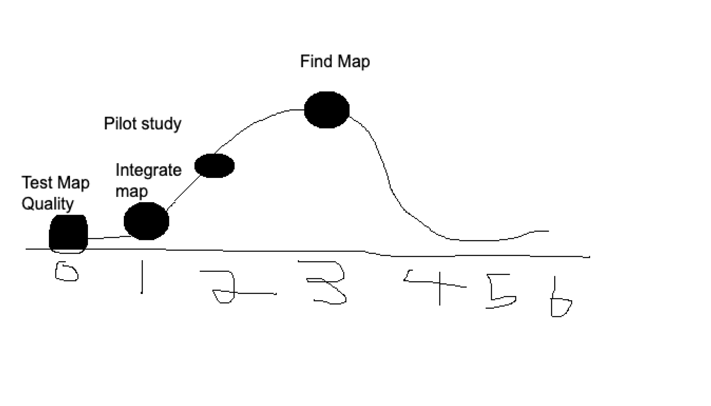

# SEG4105 Lab 7

# Contributors

- Ranbir Brar (Student #: 300116072)

# Daily Standup

- Researched for methods to do image zooming with react native. Found this useful article: https://javascript.plainenglish.io/react-native-image-zooming-with-gesture-handler-376193e3d3b4. Began trying to understand the code so we can implement the feature in our project.

# Current Hill Chart status

# Team meeting schedule

- We will be having our weekly meetings on Saturdays at 7 PM
